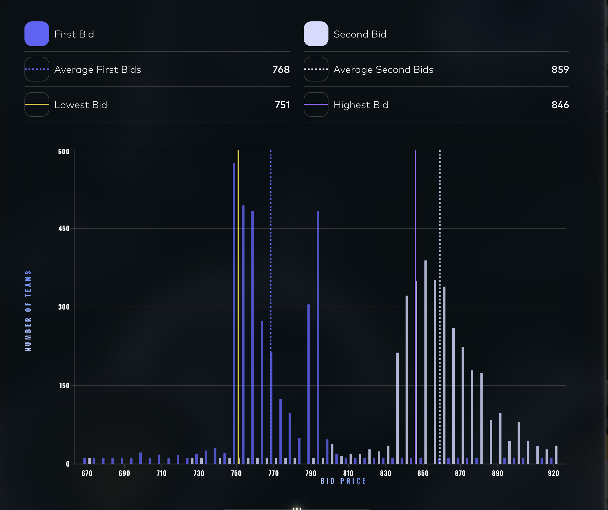

# The Manual Track

## Round 1 — two sealed bids

**The puzzle.** Two goods, each with a stale order book. Anything acquired is resold at a
fixed price after the auction: **Dryland Flax at 30**, **Ember Mushroom at 20** (the latter
with a 0.05 fee on each side). Submit one price and one volume per good.

**What I submitted.**

| | bid | volume | result |
|---|---:|---:|---:|
| Dryland Flax | 30 | 10,000 | **0** |
| Ember Mushroom | 18 | 35,000 | **66,500** |

**Mushroom was priced correctly and sized wrongly.** 35,000 lots at 20 − 18 − 0.1 = 1.9 each
gives exactly the 66,500 realised. But the platform's own PnL-versus-volume curve for that bid
price peaks near **80,000 at a volume around 20,000** — a smaller order would have paid more.

**Flax returned nothing.** At the same bid price the curve peaks near 10,000 at a volume around
5,000; at exactly 10,000 it falls to zero, and that is where the order sat.

> **The lesson is the shape of the curve, not the arithmetic.** On both goods the payoff
> against volume is **sawtoothed, not monotone** — more size is not more profit, and the
> optimum sits below the largest fillable quantity on each. Both orders were sized by
> eyeballing the resting depth, which is the reasoning that produces a round number like
> 10,000 and lands it on a cliff.
>
> The exact matching rule cannot be recovered from the screenshots, so the mechanism behind
> the sawtooth is unresolved. What is not in doubt is that the platform published the curve
> **after** the fact and it was not flat.

---

## Round 2 — three multiplicative pillars

**The puzzle.** Split a 50,000 budget as percentages across Research, Scale and Speed.

$$\text{PnL} = \text{Research}(x) \times \text{Scale}(y) \times \text{HitRate}(\text{rank}(z)) - 50{,}000$$

Research grows logarithmically (200,000 at 100%), Scale linearly (×7 at 100%), and Speed is
scored by **spend rank against every other team** — 0.9 at the top, 0.1 at the bottom, linear
between.

**What I submitted, and what it produced.**

| pillar | allocation | value |
|---|---:|---|
| Research | 23% | 137,724 |
| Scale | 76% | ×5.3 |
| **Speed** | **1%** | **hit rate 0.12, rank #4179** |
| | | total 90,296 − 50,000 = **40,296** |

**The first two are near their unconstrained optimum. The third is the whole story.**

Research and Scale are deterministic functions of the allocation — solvable in closed form
once the Speed share is fixed. Speed is not: it is a **rank against the field**, so it is the
only pillar where the answer depends on what everyone else does, and it enters the product as
a multiplier ranging over **0.1 to 0.9 — a factor of nine**.

Allocating 1% placed me at rank 4,179 and collected 0.12, near the floor of that range.

> **The structural point:** the two solvable pillars were solved and the one requiring a model
> of the field was left at its minimum. A multiplier spanning 9× dominates a logarithmic term
> that has already flattened — Research at 23% already captures 69% of what 100% would yield,
> so the marginal percentage point is worth far more in Speed than in Research.
>
> **What I cannot reconstruct** is where the field actually clustered, so I cannot state the
> optimal Speed allocation — only that 1% was on the wrong side of the trade-off, and that
> the pillar deciding it was the one no closed form covers.

---

## Round 3 — the bidding game

**The puzzle.** Submit two bids $b_1 < b_2$. Each counterparty draws a reserve uniformly from
{670, 675, …, 920}. Reserves below $b_1$ trade at $b_1$; those between trade at $b_2$ — but at
full profit only if $b_2$ exceeds $\mu$, the average second bid across all teams. Below $\mu$
the profit is multiplied by $\left(\frac{920-\mu}{920-b_2}\right)^3$.

**This was the best round of the competition, on either track.**

| | score | round rank |
|---|---:|---:|
| algorithm | 5,841 | **2,093rd** |
| **manual** | **70,444** | **442nd** |

Twelve times the algorithm's contribution, and a rank five times better.

**What I submitted: $(b_1, b_2) = (751, 846)$. The realised $\mu$ was 859.**

### $b_1 = 751$ is exactly right

$b_1$ is a pure optimisation with no game in it — it does not enter the penalty, so it does not
depend on anyone else. Maximising $P(r < b_1) \times (920 - b_1)$ over the 51 reserve values
gives **751**, and that is what was submitted. The field's average first bid was 768, so most
teams overpaid here.

### $b_2 = 846$ landed 13 ticks under the cliff

The penalty at $\mu = 859$:

$$\left(\frac{920-859}{920-846}\right)^3 = \left(\frac{61}{74}\right)^3 = 0.560$$

**Forty-four percent of the second leg was given away.** What that cost, holding $b_1$ fixed:

| $b_2$ | 846 (submitted) | 855 | **860** | 865 | 880 |
|---|---:|---:|---:|---:|---:|
| EP per unit | 71.78 | 77.40 | **81.04** | 80.06 | 75.94 |
| implied score | **70,444** | 75,965 | **≈ 79,500** | 78,574 | 74,532 |

The optimum sits at **860 — one tick above the realised $\mu$** — worth about **9,100 more**,
or 13%.

### The shape of the problem is what makes 846 the wrong kind of miss

The payoff is **asymmetric around $\mu$**. Bidding above it costs only the extra paid per unit,
so the curve declines gently: even 880, twenty-one ticks too high, still beats 846. Bidding
below it triggers a cubic penalty, and the curve falls off a cliff.

**Under that asymmetry the estimate of $\mu$ should not be centred — it should be biased
upward**, because the two errors are not priced the same. 846 was below the naive
penalty-ignoring optimum's own neighbourhood and well below where the field was always going
to cluster: the penalty gives every team a reason to sit just above $\mu$, which pushes $\mu$
up, and the realised 859 came in 23 ticks above the 836 that ignoring the penalty suggests.

*A team finishing 57th overall submitted (766, 861) — two ticks above the realised $\mu$ — and
scored 80,862, top 1% for the round. Their $b_1$ was 15 ticks worse than mine; their $b_2$ was
on the right side of the cliff, and that decided it.*

### The analysis that survives

`quant-journey/prosperity4/manual.ipynb`, 36 cells: Monte Carlo simulation of $b_1$, iterated
best-response to locate the $b_2$ equilibrium, a player-archetype mixture (Nash / undercut /
overshoot / random / grief), and a stability check around the equilibrium.

**Its $b_2$ range was 855–865 — which contains the optimum.** The submitted 846 is below that
range, so the final number did not come from the model that was built.

## Round 4 — the option portfolio

**The puzzle.** Twelve contracts on an underlying at 50 with 251% annualised volatility: six
three-week vanillas, two two-week vanillas struck at 50, a chooser, a binary 40-put and a
knockout 45-put. Limits 200 on the underlying, 50 per option, 500 on the knockout. The
platform scores the **average payoff across 100 simulated paths**, which suppresses
single-path variance.

**What I submitted.**

| contract | side | volume | limit |
|---|---|---:|---:|
| `AC_50_C` (3w 50-call) | BUY | 42 | 50 |
| `AC_45_P` | BUY | 50 | 50 |
| `AC_50_P_2` (2w) | BUY | 50 | 50 |
| `AC_50_C_2` (2w) | BUY | **15** | 50 |
| `AC_50_CO` (chooser) | SELL | 50 | 50 |
| `AC_40_BP` (binary) | SELL | 50 | 50 |
| `AC_45_KO` (knockout) | BUY | **390** | 500 |
| `AC_35_P` | SELL | **0** | 50 |

**Five of the seven active legs match the 57th-place team's portfolio exactly** — same
contracts, same directions, same sizes at the limit. The differences are all sizing:

| | mine | theirs |
|---|---:|---:|
| 3w 50-call | 42 | 25 |
| 2w 50-call | **15** | 50 |
| knockout 45-put | **390** | 500 |
| 35-put | direction chosen, **volume 0** | not held |

**The score is not recorded**, so the sizing differences cannot be priced.

Two observations that do not need the score. **The 35-put has a direction selected and a
volume of zero** — a partially entered leg, not a decision. And the two legs sized below their
limits (2w 50-call at 15/50, knockout at 390/500) are the two where their portfolio went to the
bound; if the leg is correctly signed, a limit-constrained EV maximum has no reason to stop
short.

> The chooser decomposition — $\text{chooser}(\text{ATM}, r{=}0) = C(3w, 50) + P(2w, 50)$ —
> makes the 3-week 50-call the natural hedge for a short chooser, and both portfolios hold it.
> The size difference (42 against 25) is the difference between hedging the position and
> holding a directional view on top of it.

---

## Round 5 — news-driven allocation

**The puzzle.** Nine goods, a 1,000,000 budget, each position a signed percentage, with a
**quadratic fee $f(x) = x^2 \times 1{,}000{,}000$**. The only input is a newspaper: one short
article per good.

**The fee determines the sizing rule exactly.** Maximising $xr - x^2$ over the allocation $x$
given signal strength $r$ gives

$$\boxed{x^\star = r/2}$$

Anything beyond that costs more in fee than it earns. And since $r$ should be the
**confidence-weighted** return $(2p - 1) \times \text{magnitude}$, a direction guessed at
$p = 0.5$ has $r = 0$ regardless of how large the move is.

**What I submitted.**

| good | side | % | investment | fee |
|---|---|---:|---:|---:|
| Lava cake | SELL | 29% | 290,000 | **84,100** |
| Pyroflex cells | SELL | 19% | 190,000 | 36,100 |
| **Ashes of the Phoenix** | SELL | **19%** | 190,000 | **36,100** |
| Thermalite core | BUY | 12% | 120,000 | 14,400 |
| Sulfur reactor | BUY | 12% | 120,000 | 14,400 |
| Obsidian cutlery | SELL | 3% | 30,000 | 900 |
| Magma ink / Scoria paste / Volcanic incense | BUY | 2% each | 20,000 each | 400 each |
| **total** | | **100%** | 1,000,000 | **187,200** |

**The directions largely match the 57th-place team's. The sizes do not.**

| | mine | theirs |
|---|---:|---:|
| budget used | **100%** | 65% |
| fee paid | **187,200** | 77,100 |
| Lava cake | 29% | 20% |
| Pyroflex | 19% | 5% |
| **Ashes of the Phoenix** | **19%** | 4% |

**`Ashes of the Phoenix` is the clearest case.** The article is a negative video about sourcing
*plus* a company rebuttal that neutralises most of it — an ambiguous signal, so a small $p$,
so a small $r$, so a small $x$. It received 19% and cost 36,100 in fee alone.

> **The rule $x^\star = r/2$ is not a heuristic; it is the exact solution to the fee the puzzle
> specifies.** Spending the full budget means every allocation was set by something other than
> that rule. **The score is not recorded**, so the cost cannot be quantified — but the fee can:
> 187,200 against 77,100 for a portfolio holding similar views.

---

## What is missing, and why it matters

| | missing |
|---|---|
| Round 3 | the submission and the score — the analysis is the most developed of the five and cannot be graded |
| Rounds 4, 5 | the scores — the submissions are recorded, so the sizing choices are visible but not priced |

The algorithmic rounds are fully reconstructable because the exchange returns a log. **The
manual rounds return nothing but a number on a results page**, so a review of them depends
entirely on what was saved at the time. Three of five were not.
