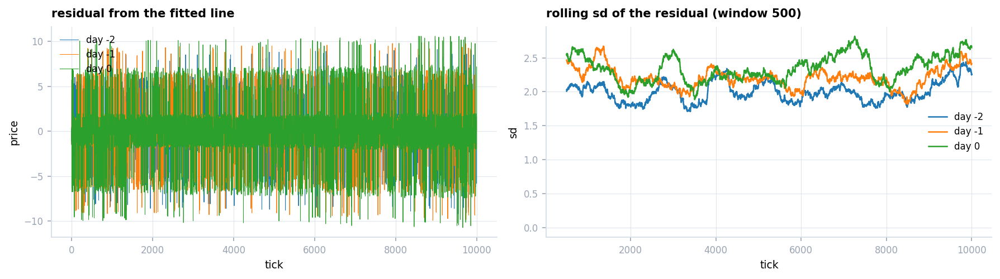
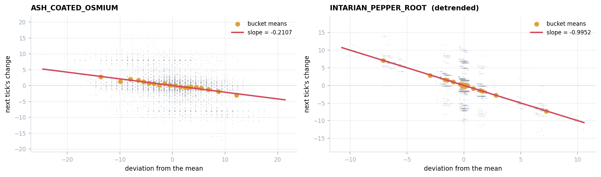
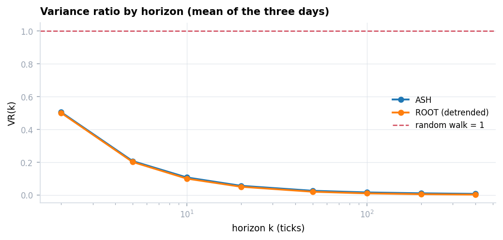
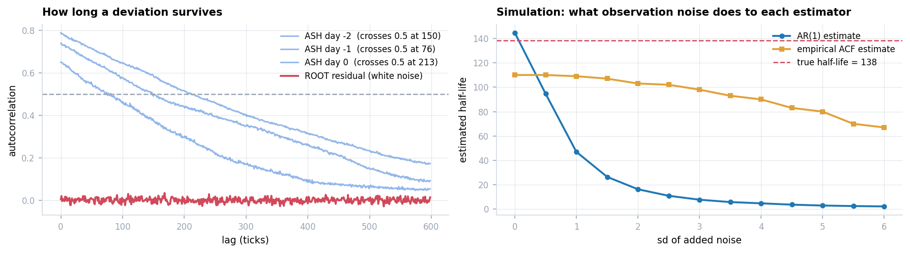
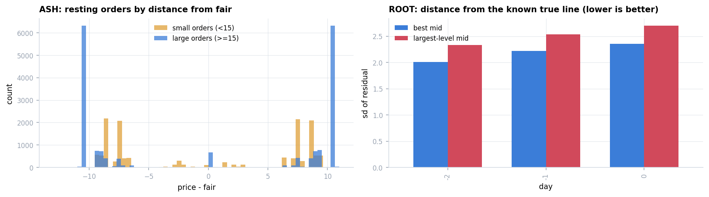
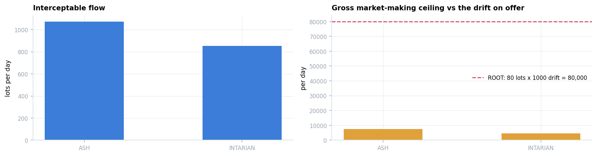
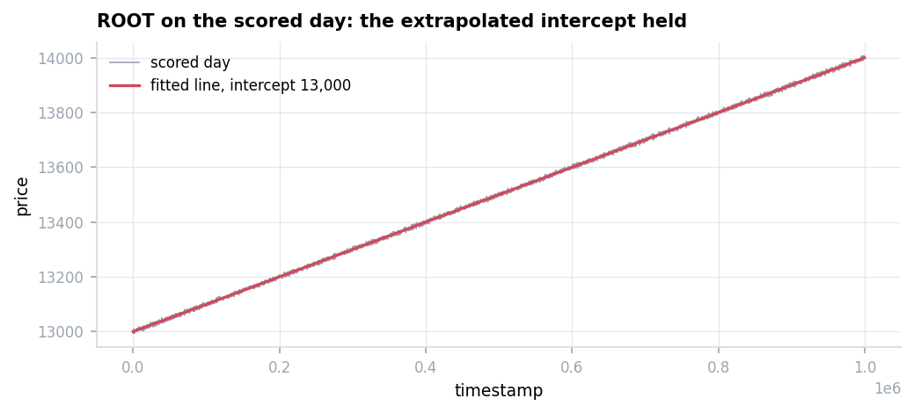

# Round 1 — Trend and Mean Reversion

Two products, position limit ±80 each: `INTARIAN_PEPPER_ROOT` (ROOT) and
`ASH_COATED_OSMIUM` (ASH). **Scored 99,762.**

Derivation, with the code and the plots: **[`research/round1.ipynb`](../../research/round1.ipynb)**.
Everything below summarises it. The submitted algorithm is
[`submissions/round1.py`](../../submissions/round1.py), unmodified.

---

## 1. What I submitted

### ROOT — deterministic drift, long only

$$\text{fair}_t = c_t + \mu t, \qquad \mu = 0.001 \ \text{(hard-coded)}$$

$c_t$ is a cumulative mean of $(m_t - \mu t)$, updated only when both sides of the book are
non-empty; $m_t$ is the best bid/ask midpoint.

```
CAP <- 80 - q
for p in sorted(offers):                 # cheapest first
    if CAP <= 0: break
    if p <= fair + 10:                   # BUY_BUFFER
        v <- min(size(p), CAP); BUY v @ p; CAP <- CAP - v
if CAP > 0 and bids non-empty:
    BUY CAP @ min(best_bid + 1, floor(fair))
```

**There is no sell branch.** The routine emits only buy orders, so the position can only
increase, up to the limit.

### ASH — inventory-skewed market making

$$f_t = \alpha_t m_t + (1-\alpha_t) f_{t-1}, \qquad
\alpha_t = 0.05 + 0.05\min\!\big(|m_t - f_{t-1}|/5,\ 1\big)$$

$$\tilde f_t = f_t - 0.3\,s_t \cdot \tfrac{q}{80} \qquad (s_t = \text{spread})$$

Lift offers below $\tilde f_t$, hit bids above it, and post at $b_t+1$ / $a_t-1$ whenever
those prices sit on the profitable side of $\tilde f_t$. Quote size
$\mathrm{clip}(\lfloor 0.6\,\bar v_t \rfloor, 10, 30)$.

---

## 2. What it did

| Product | PnL | Fills | Volume | Final position |
|---|---:|---:|---:|---:|
| ROOT | **79,403** | 8 | 80 | +80 |
| ASH | **20,359** | 755 | 4,382 | +22 |

**ROOT: eight fills, all within the first 900 timestamps, then nothing all day.** The limit
was reached immediately by lifting offers; thereafter `CAP = 0` and the routine emits
nothing. The 79,403 is mark-to-market on a static long: $80 \times (14{,}000 - 12{,}998)$.

**ASH: 755 fills spanning the whole session**, 2,202 lots bought against 2,180 sold — a
working two-way loop, earning the spread rather than holding.

### How the internal state was recovered

The log records the book and every fill but nothing the algorithm computed — all 10,000
`lambdaLog` entries are empty. The unmodified source is therefore executed under
`sys.settrace`, one timestamp at a time, against `TradingState` objects rebuilt from the log.
Matching is not simulated: the book and the fills are the real ones.

**Falsification test.** Every fill the exchange awarded must be explained by an order the
replay emits at that timestamp, on the correct side, at a compatible price:

| Own trades | Explained |
|---:|---:|
| 763 | **763 (100%)** |

Below 100%, nothing in this document about *why* a decision was taken would stand.

**Tick-by-tick replay:** [ASH](replay/ash.html) · [ROOT](replay/root.html) — open and drag
the timeline. Each frame shows the book, my own resting quotes, the fair price, and a
line-by-line account of that instant's decision.

Two things it exposes that summary statistics do not: on one-sided books the fair price
**stops updating entirely** (the guard requires both sides), and the "adaptive" quote size
sits at its lower bound of 10 almost always.

---

## 3. What the market actually is

Estimated on the three pre-round days only; the scored day is held back for §5.

### ROOT is a deterministic line, not a random walk with drift

Both fit a straight line with high $R^2$, so $R^2$ decides nothing. The residual does: under
a random walk its dispersion grows like $\sqrt{t}$; under a line plus observation noise it is
constant.



| day | slope | intercept | $R^2$ | sd(resid) | 1st half | 2nd half | VR(200) |
|---:|---:|---:|---:|---:|---:|---:|---:|
| −2 | 0.001 | 9,999.98 | 0.99995 | 2.01 | 2.00 | 2.02 | 0.005 |
| −1 | 0.001 | 10,999.96 | 0.99994 | 2.22 | 2.24 | 2.20 | 0.005 |
| 0 | 0.001 | 11,999.95 | 0.99993 | 2.36 | 2.29 | 2.43 | 0.005 |

Flat. **Random walk with drift is ruled out.**

The intercepts are **10,000 / 11,000 / 12,000** — an exact arithmetic sequence, so the scored
day should open at 13,000. A structural fact, not a fitted parameter.

> ⚠️ **Units.** $\mu = 0.001$ is per *timestamp*; one tick spans 100 of them, and a session is
> 1,000,000 timestamps — a move of 1,000. Reading it as "per tick" understates the drift a
> hundredfold and inverts the entry calculation in §4.

### ASH mean-reverts — and the slope alone does not establish it



Regressing the next increment on the current deviation gives **−0.21** for ASH. But ROOT's
detrended residual gives **−0.99** — steeper, and untradeable. A slope near −1 means the
deviation is *entirely gone by the next tick*: white noise around a fixed line. A small
negative slope means it decays slowly enough to act on.

The variance ratio does not separate them either:

| | slope | VR(200) | what it is | tradeable |
|---|---:|---:|---|---|
| ASH | −0.21 | 0.011 | slow mean reversion | yes |
| ROOT residual | −0.99 | 0.005 | white noise around a line | no |



**VR separates mean reversion from a random walk, not slow reversion from instantaneous
noise.** For that, measure how long a deviation survives.

### How long a deviation survives — and where the textbook estimator fails



The left panel settles it: ASH's autocorrelation stays above 0.5 for **76–213 lags**; ROOT's
residual collapses to zero within a couple. Same low VR, opposite tradability.

The right panel is a separate problem. Discretising OU gives an AR(1) whose implied half-life
is **1.6–2.9 ticks** — two orders of magnitude below the measured value. The simulation shows
why: a series with a known half-life of 138 is contaminated with rising observation noise,
and the AR(1) estimate collapses toward zero (**attenuation bias**) while the autocorrelation
estimator degrades gently.

**A position taken on a deviation must survive $10^2$ ticks, not $10^0$.**

### A plausible idea the data rejects

The book is two-layered — large orders outside, small ones interleaved inside — suggesting
the fair price should be the midpoint of the **largest-size level**. ROOT's known straight
line lets the two estimators be scored directly:



| estimator | sd of residual, days −2 / −1 / 0 |
|---|---|
| best bid/ask midpoint | **2.01 / 2.22 / 2.36** |
| largest-size level midpoint | 2.34 / 2.54 / 2.70 |

**Worse on every day.** The outer levels sit far from fair, so asymmetry between the sides is
amplified; the inner-order noise in the plain midpoint is symmetric and largely cancels.
**Structure existing is not the same as structure being useful.**

### What is available to be earned



| | interceptable flow/day | median spread | gross MM ceiling/day |
|---|---:|---:|---:|
| ASH | 1,074 lots | 16 | **7,518** |
| ROOT | 852 lots | 13 | **4,686** |

For ROOT the drift dominates sixteen to one: $80 \times 1{,}000 = 80{,}000$ against 4,686.
**But 4,686 a day is not nothing, and the submission collected none of it.** For ASH there is
no drift term, so 7,518 plus whatever the OU deviation is worth is the entire opportunity.

---

## 4. The correct answer

Full specification: **[`answer.md`](answer.md)** — symbols, value function, quoting policy,
and an evidence table mapping every rule to the measurement it rests on.

Fifteen rules; fourteen rest on a measurement or on the exchange mechanics, one is a stated
risk preference and is labelled as such.

The three that most change the outcome:

**Lift, do not wait.** Resting for 75 lots takes until timestamp 86,800, so the average lot
arrives ~43,400 late — 43.4 of forgone drift per lot, against 8.1 to lift the offer.

**Target inventory is linear in deviation.** Bucketing ASH by distance from the mean and
measuring the realised move over the next 130 ticks gives eleven monotone buckets, crossing
zero at zero deviation, with coefficient −0.5. Half the deviation reverts within one
half-life, which is what a half-life means — the two measurements were taken independently
and agree.

**Depth imbalance leans the quote.** Three-level imbalance predicts the outer fair with
coefficient +2.4 (ASH) and +2.6 (ROOT), persisting to 50 ticks. It cannot be crossed on:
full imbalance predicts 4.9 against a crossing cost of 8.

One rule that looked worth adopting and is not: **quote size**. Arriving flow has a median of
5 lots and a maximum of 13, so quoting 10 captures 99.8% and quoting the full remaining
capacity captures 100%. The choice is immaterial.

## 5. Out-of-sample check



| | predicted from the pre-round days | realised on the scored day |
|---|---|---|
| ROOT intercept | 13,000 (arithmetic extrapolation) | **12,999.9**, $R^2 = 0.99992$, sd(resid) 2.60 |
| ASH mean | ≈10,000 | 10,000.18 |
| ASH VR(50) | ≈0.025 | 0.027 |

Both held.

The distinction matters for what follows: ROOT's intercept is an exact arithmetic sequence —
a structural fact — whereas ASH's mean and reversion speed are statistical estimates.
**Round 2 is where one of them breaks.**

---

## Where the round was lost

| | done right | missed |
|---|---|---|
| ROOT | identified the line and held the position — 79,403 against a drift term of 80,000 | no sell branch at all; ~4,700/day of spread never touched |
| ASH | clean market making, +4.9 per lot | mean reversion never used — inventory identical at 9,990 and 10,010, and mark-to-market on the position over the whole session was **+101** |

Both omissions have the same shape: **the most visible feature of each product was traded,
and the second one was never looked for.**
