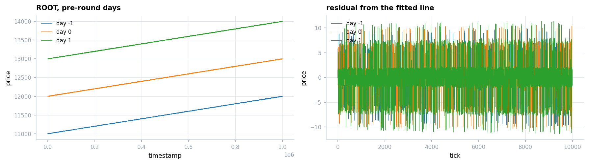
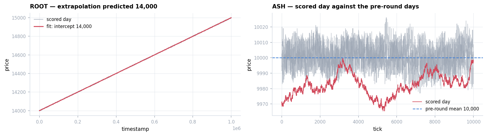
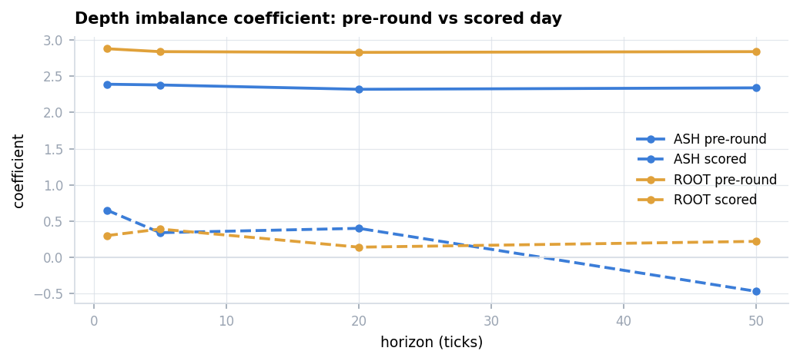
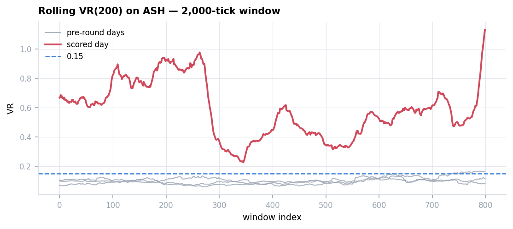
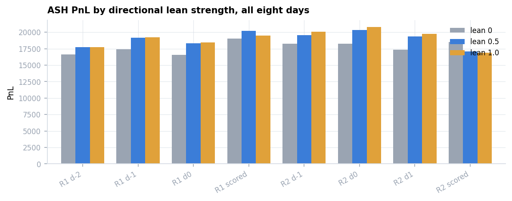

# Round 2 — When the Parameters Broke

Same two products as Round 1, a new scored day. **Scored 99,035.**

The question is not what these products are — Round 1 settled that — but **whether Round 1's
conclusions still hold**. Two of them do. Two do not, and both fail on the same day.

Derivation: **[`research/round2.ipynb`](../../research/round2.ipynb)**.
Specification: **[`answer.md`](answer.md)**.
Submission: [`submissions/round2.py`](../../submissions/round2.py), unmodified.

---

## 1. What I submitted

Round 1's algorithm with two edits, neither of which re-examined the models.

**ROOT: unchanged, byte for byte.**

**ASH, edit 1** — the fair-price observation moves off the touch to the *second* level when
three or more are quoted, intending to step past small orders resting inside the spread:

$$\tilde b_t = B_t^{(2)} \ \text{ if } |B_t| \ge 3, \quad \tilde a_t = A_t^{(2)} \ \text{ if } |A_t| \ge 3,
\qquad m_t = \tfrac{\tilde b_t + \tilde a_t}{2}$$

**ASH, edit 2** — a minimum edge $\epsilon = 2$ inserted into every comparison against the
skewed fair, so the algorithm acts only when the price clears $\tilde f_t$ by at least 2.

Neither product's model was re-estimated. `MU = 10000` remained hard-coded.

---

## 2. What it did

| Product | PnL | Round 1 |
|---|---:|---:|
| ROOT | 79,361 | 79,403 |
| ASH | 19,674 | 20,359 |
| **Total** | **99,035** | 99,762 |

Replay verification: **632 own trades, 632 explained (100%)**.
Tick-by-tick: [ASH](replay/ash.html) · [ROOT](replay/root.html).

### Where the ASH result came from

Splitting PnL into spread earned per fill and mark-to-market on inventory carried:

| | execution | direction | total | edge per lot |
|---|---:|---:|---:|---:|
| my submission | 12,270 | **7,415** | 19,685 | +3.46 |
| Round 1's specification, re-run | **14,162** | 4,330 | 18,492 | **+4.52** |

**Execution was worse** — 1.06 less per lot, 1,892 in total. The $\epsilon = 2$ guard
suppresses marginal quotes and trades; that is its cost.

**The outperformance came from carrying inventory**: +25 average against +4.4, on a day
that drifted from 9,979 to 9,988.

Was that skill? Correlate the position held against the next tick's move:

| | correlation |
|---|---:|
| my submission | **+0.024** |
| Round 1 specification | +0.011 |

Both indistinguishable from zero. **The 3,085 came from carrying size on a day that happened
to rise, not from anticipating it.**

> Contrast Round 1's ROOT, where 79,403 is 96% of what the optimal policy achieves — that
> design was right. Both are "made money"; only the decomposition separates them.

---

## 3. What the market actually is

### Conclusion A — ROOT's line: **holds, and predicts**

| day | slope | intercept | $R^2$ | sd(resid) |
|---:|---:|---:|---:|---:|
| −1 | 0.001 | 11,000.0 | 0.99994 | 2.20 |
| 0 | 0.001 | 12,000.0 | 0.99993 | 2.36 |
| 1 | 0.001 | 13,000.0 | 0.99992 | 2.54 |

With Round 1's days that is **10,000 → 11,000 → 12,000 → 13,000**, four consecutive days,
no error. Extrapolation gives **14,000**.

### Conclusions B and C on the pre-round days: **both intact**

ASH: mean near 10,000, slope ≈ −0.3, VR(50) ≈ 0.025, half-life in the tens to low hundreds.
Depth imbalance: coefficient 2.4–2.9, significant to 50 ticks.

**Indistinguishable from Round 1. Nothing in the pre-round data warns of what follows** —
which is why carrying the parameters forward was reasonable, and wrong.

### The scored day

**A held exactly:** intercept **14,000.0**, $R^2 = 0.999999$, residual sd **0.21** — ten times
tighter than any pre-round day.

**B did not:**

| | pre-round (7 days) | scored day |
|---|---:|---:|
| mean | ~10,000 | **9,982.35** |
| sd | 4.6 – 5.8 | **7.08** |
| half-life | 54 – 213 | **625** |
| VR(200) | 0.009 – 0.011 | **0.339** |

The 18-point level shift is the visible symptom. **The consequential change is persistence**:
a position sized for a ~130-tick reversion must now be carried five times as long. Intraday
quartile means are 9,978.8 / 9,984.8 / 9,978.2 / 9,987.6 — no trend within the day. The level
moved *between* days and then stayed.

**C did not either — and this is the finding that reframes the round:**

| | pre-round | scored day |
|---|---:|---:|
| ASH | +2.39 (t = 36.9) | **+0.65 (t = 2.7)**, negative by h=50 |
| ROOT | +2.88 (t = 47.6) | **+0.30 (t = 3.4)** |

The imbalance signal is measured independently of the mean reversion. **Both fail on the
same day.**

### Ruling out the obvious objection

The scored day is reconstructed from the submission log rather than supplied as a CSV, so
the collapse could be an artefact of the reconstruction. Round 1's scored day, processed
identically:

| | h=1 | h=20 | h=50 |
|---|---:|---:|---:|
| **R1 scored** ASH | +2.37 (t = 21.5) | +2.18 (t = 4.0) | **+2.36 (t = 2.4)** |
| **R1 scored** ROOT | +3.20 (t = 27.0) | +3.23 (t = 6.1) | **+3.07 (t = 3.7)** |
| **R2 scored** ASH | +0.65 (t = 2.7) | +0.40 (t = 0.1) | **−0.47 (t = −0.1)** |

Round 1's scored day retains the signal at its pre-round strength. **The reconstruction is
not the cause. Round 2's scored day is a different regime.**

### It was detectable while it was happening

Rolling VR(200) on a 2,000-tick window, from the same book snapshots the algorithm already
receives:

| | median | 90th pct | share of session above 0.15 |
|---|---:|---:|---:|
| pre-round days | 0.090 – 0.099 | ≤ 0.137 | **0 – 7.5%** |
| scored day | **0.579** | 0.869 | **100%** |

Cleanly separable, for the entire session. No hindsight required.

---

## 4. The correct answer

Full specification: **[`answer.md`](answer.md)**.

**ROOT: reuse Round 1 unchanged, and seed the intercept from the sequence** rather than
estimating it cold. The cold start is when the whole position is built, so it is exactly when
the fair price must already be right.

**ASH: the reversion term needs a validity condition — not deletion.**

| lean strength | 0 | 0.5 | 1.0 |
|---|---:|---:|---:|
| ASH, mean of all eight available days | 17,754 | **18,969** | 19,056 |

**Seven of eight days favour leaning.** Removing it because of one bad day costs about 1,200
a day. The gate turns the term off when the assumption it rests on stops holding; the
fallback is pure spread capture, which does not depend on that assumption.

> **An honest caveat, recorded rather than tuned away.** A first implementation of the gate
> recovered +1,399 on the scored day but lost more, in small amounts, across the seven normal
> days — about −900 net. The cause is identified: the offline diagnostic computes VR on a
> gap-filled series while the in-algorithm version skips one-sided ticks, so the baselines
> differ and the threshold does not transfer. Searching the threshold over the same eight
> days would produce a number fitted to those eight days — the same error as choosing
> parameters from pre-round data and discovering on the scored day that they no longer apply.

---

## 5. What this round is about

| | ROOT intercept | ASH mean and reversion speed |
|---|---|---|
| what it is | an exact arithmetic sequence, four days, zero error | statistical estimates |
| pre-round evidence | $R^2 = 0.9999$ | slope significant, VR 0.025 |
| held on the scored day | **yes, exactly** | **no** |

**A structural identity can be extrapolated. An estimate must be re-verified on the day it is
used.** Goodness of fit does not distinguish the two — provenance does.

And the sharper version, which only appeared once a second, unrelated signal was measured:
**when a regime changes, it does not change one parameter. Both the reversion and the
microstructure signal failed on the same day, and the same rolling statistic would have
flagged it from the open.**
