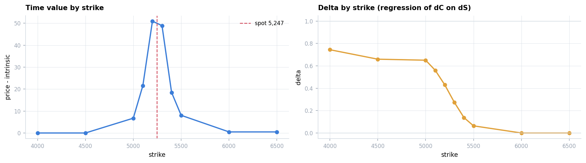
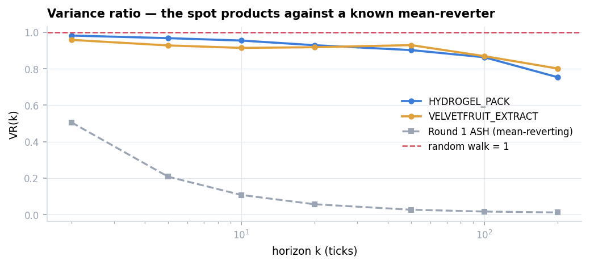
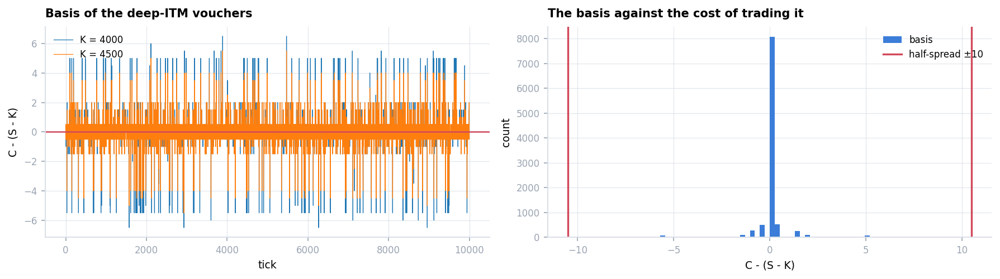
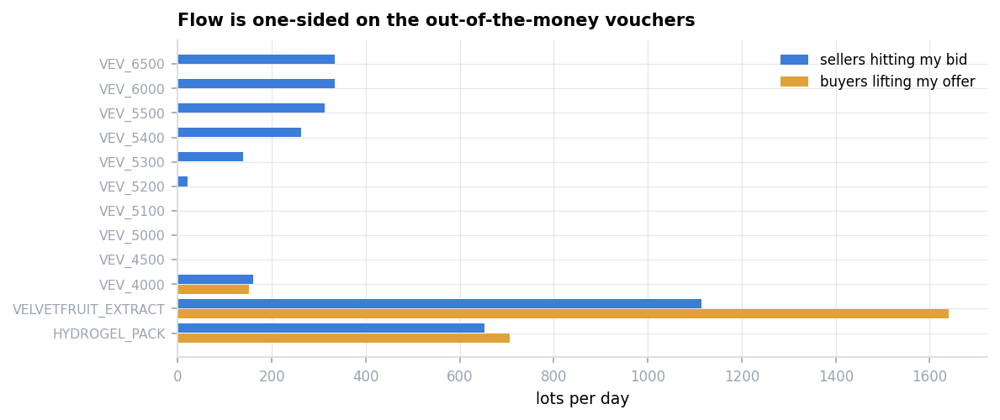
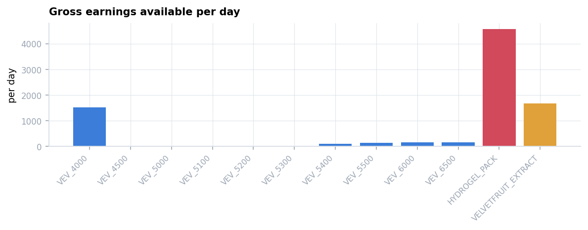
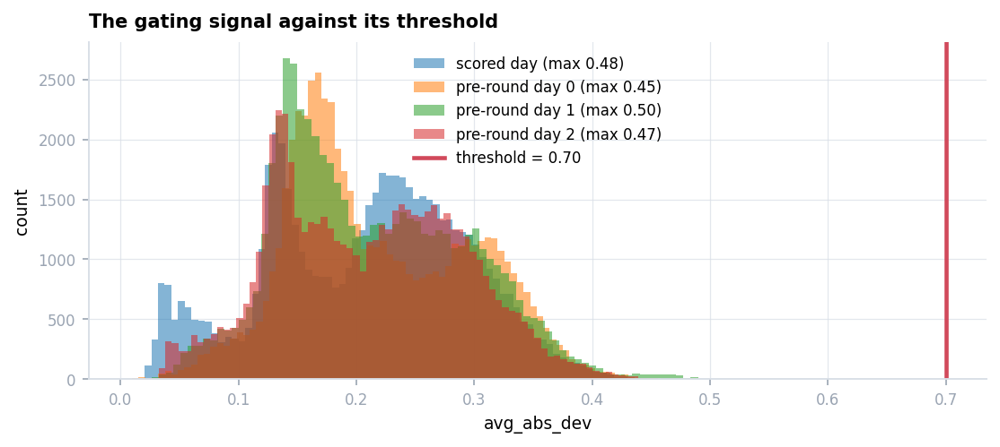
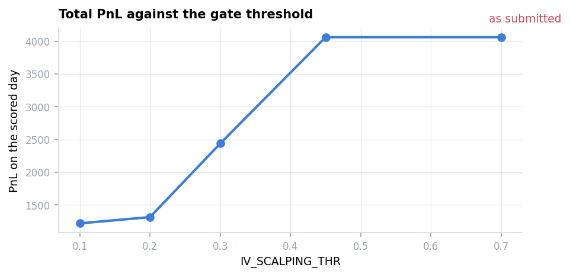

# Round 3 — The Options Round

Twelve products: `HYDROGEL_PACK` (±200), `VELVETFRUIT_EXTRACT` (±200) and ten call vouchers
`VEV_4000` … `VEV_6500` (±300 each). First scored round of Phase 2.

**Scored 5,841 — the lowest of the five. Ten of the twelve never traded.**

Derivation: **[`research/round3.ipynb`](../../research/round3.ipynb)**.
Specification: **[`answer.md`](answer.md)**.
Submission: [`submissions/round3.py`](../../submissions/round3.py), unmodified.

---

## 1. What I submitted

**Spot** — mean reversion on the deviation from a moving average, one threshold for both
products:

```
d <- price - EMA(price)
if d >  15 and sell capacity: SELL
if d < -15 and buy  capacity: BUY
```

**Vouchers** — Black-Scholes against a fitted volatility smile
$\sigma(m) = 0.034m^2 + 0.0015m + 0.2315$, trading only when the mispricing has been volatile
enough:

```python
avg_abs_dev = self.indicators['switch_means'][name]
if avg_abs_dev < IV_SCALPING_THR:      # 0.7
    continue
```

`OPTION_SYMBOLS` lists six strikes (5000–5500). **`VEV_4000`, `4500`, `6000`, `6500` appear in
the limits table but in no strategy path.**

Both legs are wrapped in `try: ... except: pass`, so a crash and silence are indistinguishable
from the log.

---

## 2. What it did

| Product | PnL | My fills |
|---|---:|---:|
| `HYDROGEL_PACK` | +7,138 | 345 |
| `VELVETFRUIT_EXTRACT` | −1,297 | 395 |
| ten vouchers | **0 each** | **0 each** |
| **Total** | **5,841** | |

**Two independent verifications for this round.** Every fill explained by the replay:
**740 / 740 (100%)**. And uniquely, this submission printed its orders every tick, so the
replay's orders can be compared directly against what was sent: **9,986 of 10,000 timestamps
identical**.

---

## 3. What the market actually is

### The vouchers are calls, and two of them are an identity



| strike | mean price | intrinsic | time value |
|---:|---:|---:|---:|
| 4000 | 1,246.52 | 1,246.51 | **0.01** |
| 4500 | 746.52 | 746.51 | **0.01** |
| 5200 | 97.47 | 46.51 | 50.96 |
| 6000 / 6500 | 0.50 | 0 | 0.50 |

Delta falls monotonically from 0.74 to 0.00 across the chain.

**At strikes 4000 and 4500 the price is an identity:** $C = S - K$, exact to 0.01. No
volatility, no expiry, nothing to estimate.

**No static arbitrage.** Monotonicity, convexity and bounds, checked on executable prices:
**zero violations on all three days.** There is no free money across strikes.

### Neither spot product can be traded directionally



| | VR(50) | reversion slope |
|---|---:|---:|
| Round 1's ASH *(reference)* | **0.025** | −0.25 … −0.39 |
| `HYDROGEL_PACK` | **0.845 – 0.961** | −0.0028 |
| `VELVETFRUIT_EXTRACT` | **0.809 – 1.030** | −0.0026 |

Both sit at the random-walk line at every horizon. The submission applied a ±15
mean-reversion rule to both; that is the source of the FRUIT loss.

### The one thing that does revert



Basis $b_t = C_t - (S_t - K)$ for the deep-ITM vouchers: mean **0.01**, sd **0.82**,
**VR(200) = 0.005** — a hundred and fifty times stronger than the underlying's 0.73, with an
equilibrium supplied by an identity rather than a fit.

> **The instruments have no structure; the relationship between them does.**

**But it cannot be traded.** The basis sd is 0.82 against a 21-tick spread on `VEV_4000` — the
entire signal fits inside half the spread, as the right panel shows. Its use is as a
fair-value estimator, more accurate than anything requiring a volatility estimate.

### The flow is one-sided — and a round-trip metric hides it



| voucher | sellers hitting my bid | buyers lifting my offer |
|---|---:|---:|
| VEV_5300 | 138 | **0** |
| VEV_5400 | 262 | **0** |
| VEV_5500 | 312 | **0** |
| VEV_6000 / 6500 | 334 each | **0** |
| VEV_4500 / 5000 / 5100 | 0 | 0 |

**On every out-of-the-money voucher, participants sell and nobody buys.** A round-trip
measure — the smaller of the two sides — scores all of them zero, and that measure is wrong
here: option market making does not require round-tripping the option, because the position
is hedged in the underlying.

### What is actually available



| | flow/day | spread | edge/lot | gross/day |
|---|---:|---:|---:|---:|
| **`HYDROGEL_PACK`** | 653 | 16 | — | **4,573** |
| **`VELVETFRUIT_EXTRACT`** | 1,114 | 5 | — | **1,672** |
| `VEV_4000` | 161 | 21 | +9.45 | **1,528** |
| `VEV_6000` / `6500` | 334 each | 1 | +0.50 | 167 each |
| `VEV_5500` / `5400` | 312 / 262 | 1 | +0.46 / +0.37 | 143 / 97 |
| `VEV_4500`, `5000`, `5100`, `5200` | ≈0 | 3–16 | — | **0** |
| **all ten vouchers** | | | | **2,104** |

**All ten vouchers together are worth less than half of `HYDROGEL_PACK` alone.**

One correction the data forces: **on a one-tick spread there is no inside to quote.** Posting
at `best_bid + 1` there means lifting the offer — paying 1 for something worth 0.5. Where the
spread is 1, the only available quote is the touch itself.

> A rank-64 team's public write-up reports the at-the-money cluster carrying the bulk of their
> voucher PnL. That cannot come from intercepting flow, since there is none at those strikes.
> It would have to come from lifting mispriced resting quotes, which requires a volatility
> model to identify. **Not tested here; left open.**

---

## 4. Why nothing traded, and what it was worth



The gate is `if avg_abs_dev < 0.7: continue`. Replaying the submitted source and extracting
that value at every tick:

| | ticks reaching the gate | max signal | times above 0.7 |
|---|---:|---:|---:|
| scored day | 9,990 | **0.4750** | **0** |
| pre-round day 0 | 9,990 | 0.4525 | **0** |
| pre-round day 1 | 9,990 | 0.5020 | **0** |
| pre-round day 2 | 9,990 | 0.4665 | **0** |

**The threshold sits 47% above the highest value the signal ever reached** — on the scored day
and on every pre-round day. About 60,000 evaluations, zero passes.

**Not a crash.** Reaching line 362 means no exception was raised; it was reached on 9,990 of
10,000 ticks. The `except: pass` swallowed nothing.

**Visible before submission.** Zero voucher orders on all three pre-round days. Printing an
order count per product exposes it in under a minute.

### But the bug was worth *negative* money



| threshold | voucher PnL | total |
|---|---:|---:|
| **0.7 (as submitted)** | **0** | **4,060** |
| 0.30 | −1,622 | 2,438 |
| 0.10 | −2,840 | 1,220 |

**Opening the gate loses money.** The threshold suppressed a strategy that was itself
unprofitable, and because it never ran, that was never discovered.

> The natural reading — *a mis-set threshold silenced the option book and cost me the round* —
> is wrong. One diagnosis is a one-line fix; the other requires discarding the approach.
> **Acting on the first would have made the round worse.**

*The voucher path has no realised fills to calibrate the simulator against, so only the sign
and ordering of these figures should be relied on. The direction is consistent across all
thresholds tested.*

---

## Replay

[`HYDROGEL_PACK`](replay/pack.html) · [`VELVETFRUIT_EXTRACT`](replay/fruit.html) ·
[`VEV_4000`](replay/vev-4000.html) — open in a browser and drag the timeline.

Each frame shows the book, my own resting quotes, the fills, and **the internal values the
algorithm computed at that instant** — the wall midpoint, the Black-Scholes theoretical price,
the difference between them, delta, vega, and `avg_abs_dev`, the quantity the gate tests.

The gate is the thing to look at: scrub anywhere in the session and `avg_abs_dev` never
approaches 0.7.

## 5. Where the round was actually lost

The rank-96 team's submission, same day, same simulator:

| | PACK | FRUIT | vouchers | total |
|---|---:|---:|---:|---:|
| mine | 7,090 | −3,030 | **0** | 4,060 |
| rank 96 | **20,848** | **13,238** | **−10,731** | 23,355 |

**Their voucher book lost more than mine, which did nothing.** Their entire 19,295 advantage
came from the two spot instruments — the two products §3 prices at 4,573 and 1,672 a day
against 2,104 for all ten vouchers combined.

**The round was not lost on options. It was lost by spending the effort there.**

*Simulator note: PACK matches the exchange to −0.7% and the vouchers to zero, but FRUIT is
1,733 pessimistic — the simulator fills marketable orders against the book snapshot at the
posted offer, while the real fills were predominantly passive.*

---

## 6. What this round examined

| | correct answer | what I submitted |
|---|---|---|
| Where does an option's fair value come from? | an **identity** where time value vanishes | Black-Scholes with a fitted smile |
| Can the underlying be traded directionally? | **no** — VR 0.85–1.03 | a ±15 mean-reversion rule |
| Where should the effort go? | `HYDROGEL_PACK` alone > all ten vouchers | almost entirely into the vouchers |

Three questions, three wrong answers — and the one that looked like the disaster was the only
one that did not cost anything.
