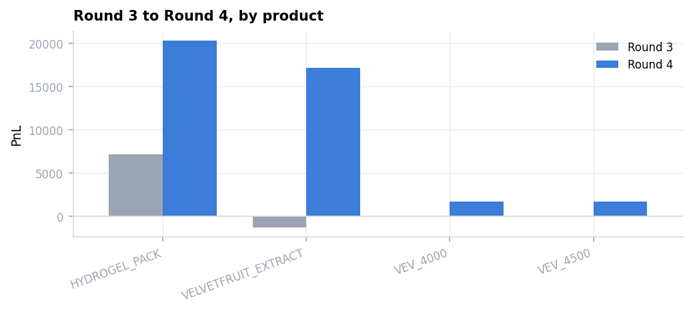
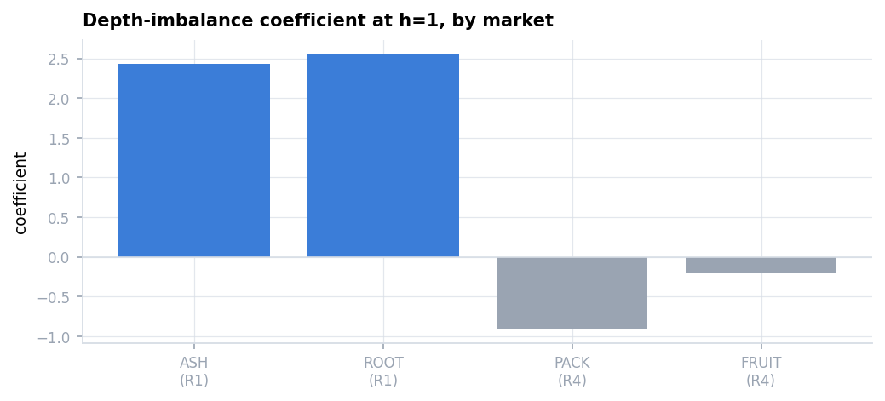
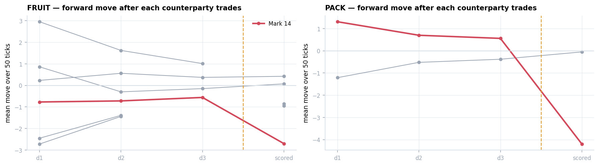
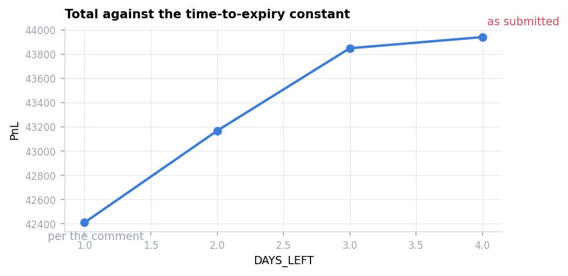

# Round 4 — Counterparties Revealed

Same twelve products as Round 3, same limits. One new field: **trade records now carry
counterparty names.** **Scored 40,036 — nearly seven times Round 3.**

Derivation: **[`research/round4.ipynb`](../../research/round4.ipynb)**.
Specification: **[`answer.md`](answer.md)**.
Submission: [`submissions/round4.py`](../../submissions/round4.py), unmodified.

---

## 1. What changed, and why it worked

| | Round 3 | Round 4 |
|---|---:|---:|
| `HYDROGEL_PACK` | 7,138 | **20,301** |
| `VELVETFRUIT_EXTRACT` | −1,297 | **17,131** |
| `VEV_4000` / `VEV_4500` | 0 | **1,694 / 1,717** |

The spot mean-reversion rule was removed and the deep in-the-money vouchers were traded for
the first time. **Those are exactly the corrections
[Round 3's specification](../03/answer.md) prescribes**, found independently during the
competition.

Replay verification: **1,272 own trades, 1,270 explained (99.84%)**. The two exceptions are
one-tick price discrepancies from a 1–2 lot drift in reconstructed position feeding the
inventory skew — not structural, but short of the 100% met in Rounds 1–3, and recorded as
such.

---

## 2. Round 3's conclusions all survive

| Round 3 finding | Round 4 measurement | |
|---|---|---|
| Spot products are random walks | VR(50) 0.881–0.961 / 0.809–1.030; slope ≈ −0.002 | ✅ |
| Deep-ITM basis pinned at zero | mean +0.00…+0.02, sd 0.77–0.91, **VR(200) = 0.0049** | ✅ |
| Flow concentrated in three products | 677 / 1,128 / 138 lots per day; the rest one-sided or empty | ✅ |

**The market did not move. The only new thing is the names.**

---

## 3. Order-book imbalance: absent in this market

| | coefficient at h=1 | $t$ |
|---|---:|---:|
| ASH (Rounds 1–2) | **+2.43** | 37.3 |
| ROOT (Rounds 1–2) | **+2.56** | 44.8 |
| `HYDROGEL_PACK` | −0.91 | −1.3 |
| `VELVETFRUIT_EXTRACT` | −0.21 | −0.7 |

Nothing, on the pre-round days and on the scored day alike. **The signal is a property of the
Rounds 1–2 market, not of the exchange** — so no imbalance term belongs in this round's
strategy.

This is the standard battery working: the same test, run everywhere, answering differently.

---

## 4. The counterparty names — and why they are not usable

An informed counterparty's purchases should precede price rises. For each name, sign every
trade it took part in by its own direction and average the mid-price change over the next 50
ticks. **Reported per day, with the scored day held back** — pooling the pre-round days into
one $t$ hides exactly what matters here.

| | d1 | d2 | d3 | scored |
|---|---:|---:|---:|---:|
| **FRUIT · Mark 14** | −0.77 (t −1.6) | −0.72 (t −1.9) | −0.56 (t −1.2) | **−2.70 (t −4.9)** |
| **PACK · Mark 14** | +1.31 (t +1.9) | +0.70 (t +1.0) | +0.56 (t +0.7) | **−4.20 (t −4.5)** |

**The same counterparty. One held; one reversed.**

And before the scored day the two look identical: consistent in sign across all three days,
and **not individually significant on any of them**. **Nothing in the pre-round data separates
them.** Any rule that admits the first admits the second.

### An independent check

A team finishing 64th on the algorithmic leaderboard fitted per-counterparty weights on this
round's data and validated leave-one-out:

> *"the weights turned out to be tuned to specific days' behaviour and didn't generalise.
> Disabling those two trader-bias scales recovered about \$15.8k of held-out PnL."*

Same conclusion, different method. **On this data the names do not support a usable signal.**

> This reverses an earlier reading of mine. Pooling the three pre-round days gave
> FRUIT · Mark 14 a $t$ of −2.70 and made it look established. The per-day view shows the
> estimate was never significant on any single day, and that its PACK counterpart was equally
> consistent and still flipped. **Pooling created the signal.**

---

## 5. Time to expiry — a wrong constant that cost nothing

The comment says the scored day takes `DAYS_LEFT = 1`; the submission has 4, overstating time
to expiry fourfold.

| `DAYS_LEFT` | 4 (as submitted) | 3 | 2 | 1 (per the comment) |
|---|---:|---:|---:|---:|
| total | **43,940** | 43,848 | 43,167 | 42,410 |

**A 3.5% spread, and the wrong value scores highest.** PACK is identical in every row.

The vouchers that trade are the deep in-the-money pair, whose value is $S-K$ regardless of
expiry. **The entire Black-Scholes apparatus, time to expiry included, barely touches this
book.**

---

## Replay

[`HYDROGEL_PACK`](replay/pack.html) · [`VELVETFRUIT_EXTRACT`](replay/fruit.html) ·
[`VEV_4000`](replay/vev-4000.html)

Each frame shows the book, my quotes, the fills, and the algorithm's internal state — the
underlying price, time to expiry, the fair value and its two inputs, the implied volatility and
its dispersion, the take threshold, and the running net delta.

## 6. Simulator fidelity — this round fails calibration

| | simulator | exchange | error |
|---|---:|---:|---:|
| PACK | 25,825 | 20,301 | **+27%** |
| FRUIT | 15,142 | 17,131 | −12% |
| `VEV_4000` / `4500` | 1,668 / 1,706 | 1,694 / 1,717 | ✓ |
| **total** | **43,940** | **40,036** | **+9.8%** |

Against 0.13% and 0.02% in Rounds 1 and 2. The volume shows why: **the simulator fills 25–30%
more than the exchange did** (PACK 1,019 against 824; FRUIT 2,841 against 2,170).

One hypothesis was tested and rejected — that prints landing *at* my quoted price should be
shared rather than awarded whole. Lowering that share made all four rounds worse, because
changing fills changes positions and therefore every later decision.

The likeliest remaining explanation is structural: **the recording already contains the effect
of the algorithm that traded that day, and cannot react to a different one.** Rounds 1–2 quote
small and passively and barely exercise that path; this round quotes large across twelve
products.

**Consequence: no fine-grained strategy comparison for this round.** Nothing in §1–§5 depends
on the simulator.

---

## 7. What this round examined

| | correct answer | what I submitted |
|---|---|---|
| Does the new information contain signal? | **No** — not one that three days can establish | not used at all |
| Do the previous round's models still hold? | **Yes**, all three | assumed, and correct |
| How should a candidate signal be validated? | per day, with the scored day held back — never pooled | — |

**Unlike Rounds 1–3 the submission is largely right.** Its gap is an opportunity not taken —
and the answer turns out to be that there was nothing there to take.
