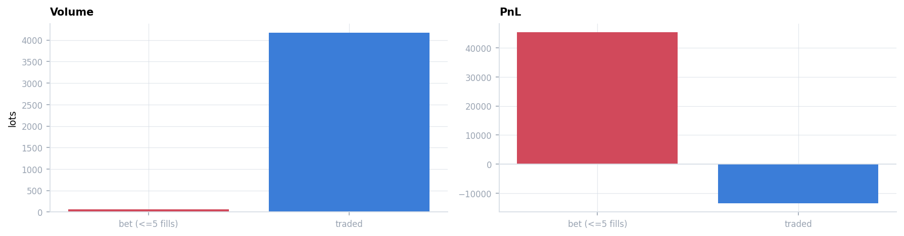
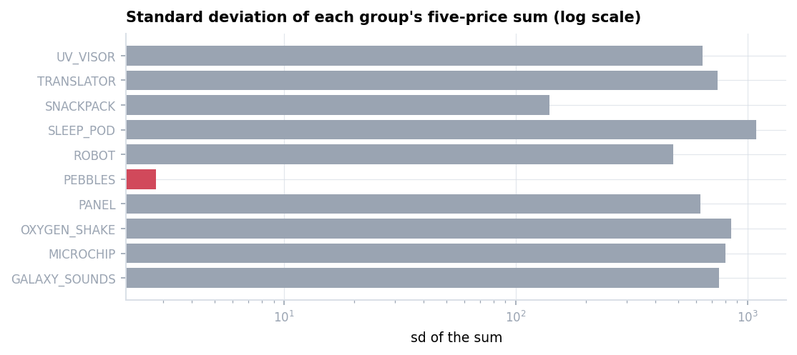
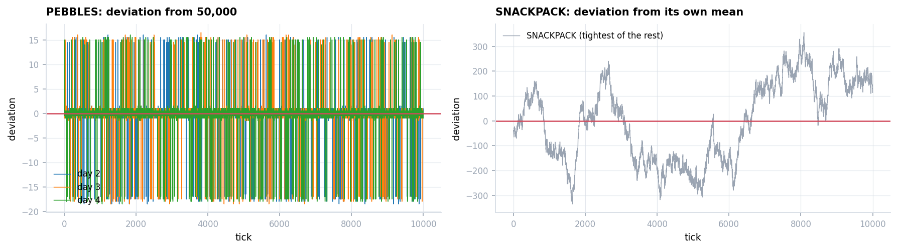
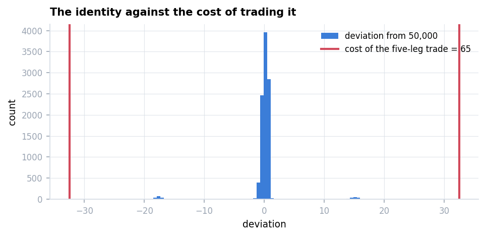
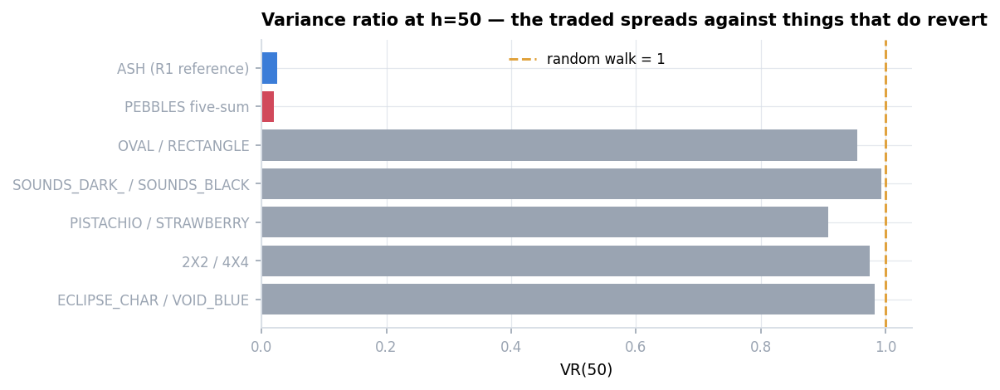
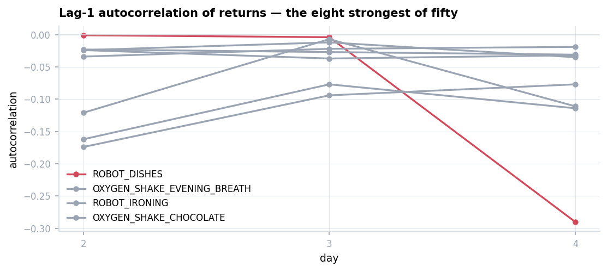
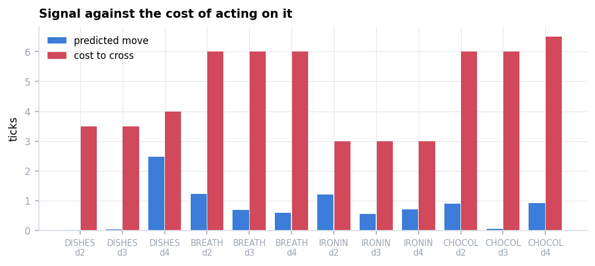
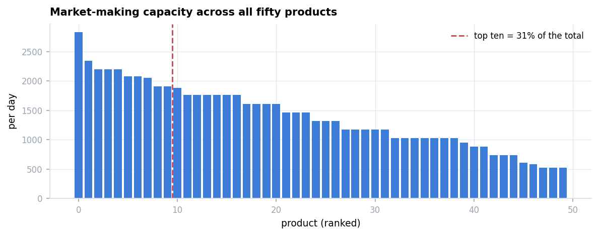

# Round 5 — Fifty Products

Fifty products in ten groups of five. **Position limit 10 per product** — an order of magnitude
tighter than earlier rounds. **Scored 31,859.**

With fifty products the question is not what each one is but **which of the many apparent
relationships are real**.

Derivation: **[`research/round5.ipynb`](../../research/round5.ipynb)**.
Specification: **[`answer.md`](answer.md)**.
Submission: [`submissions/round5.py`](../../submissions/round5.py), unmodified.

---

## 1. What I submitted, and what it produced

Three modules: five fitted pairs, six hard-coded directional bets, four market-made products.

| | products | lots | PnL |
|---|---:|---:|---:|
| **bets** (≤5 fills — opened at $t=0$, held to the close) | 6 | **60** | **+45,376** |
| **traded** (pairs and market making) | 14 | **4,175** | **−13,518** |

**Sixty lots produced the entire score. Four thousand lots lost money.**

Four bets right, two wrong. With a 10-lot limit and daily ranges above 2,000, one correct bet
is worth about 25,000 — the result was set by which way four coins landed.

**And the six directions had no basis.** Five of the six agree with only two of the three
pre-round days, the modal outcome of three coin flips. The realised four-of-six is exactly what
that predicts.

---

## 2. One group in ten carries an identity

| group | sd of the five-price sum |
|---|---:|
| **PEBBLES** | **2.76 – 2.82** |
| the other nine | 124 – 1,540 |

$$\sum_{j \in \text{PEBBLES}} P^j_t \equiv 50{,}000$$

Relative error $5.6\times10^{-5}$, on all three days. The other nine sums drift by hundreds
within a day and by **thousands between days** — their means are not even stable.

### But it cannot be arbitraged

| | |
|---|---:|
| deviation sd | **2.82** |
| cost of executing all five legs | **65** |

**The entire distribution fits inside the cost of trading it** — a factor of twenty.

Its use is as a fair-value estimator: knowing four members pins the fifth to ±3, tighter than
any single-product midpoint. **Exactly the same conclusion as Round 3's option basis, for
exactly the same reason.**

---

## 3. The five traded pairs are all random walks

| | VR(50) |
|---|---:|
| **PEBBLES five-sum** | **0.020** |
| Round 1's ASH *(reference)* | 0.025 |
| **the five traded spreads** | **0.908 – 0.993** |

**A factor of fifty.** A fitted $\beta$ makes any two series look related in sample; the
variance ratio of the resulting spread is what separates a relationship from a curve fit, and
it is one line of code.

The one quantity that reverts was left alone; five that do not were traded on the assumption
that they would. That is the −13,518.

---

## 4. Sweeping all fifty for short-horizon reversion

Lag-1 autocorrelation of returns, per day, across every product:

| product | d2 | d3 | d4 |
|---|---:|---:|---:|
| `ROBOT_DISHES` | −0.001 | −0.004 | **−0.290** |
| `OXYGEN_SHAKE_EVENING_BREATH` | **−0.174** | **−0.094** | **−0.077** |
| `ROBOT_IRONING` | **−0.162** | **−0.077** | **−0.114** |
| `OXYGEN_SHAKE_CHOCOLATE` | −0.121 | −0.007 | −0.111 |
| the other forty-six | | | never beyond 0.024 |

`ROBOT_DISHES` is the loudest and the least consistent. **By the standard Round 4 arrived at —
consistency across days rather than one striking number — the three quiet ones are the better
evidence.**

### None of them can be crossed on

| | predicted move | cost to cross |
|---|---:|---:|
| `ROBOT_DISHES`, its strongest day | 2.48 | **4.0** |
| the others | 0.55 – 1.23 | 3.0 – 6.5 |

Not one clears the spread. **That rules out taking, not quoting** — a resting order earns the
spread rather than paying it, so the autocorrelation enters as a lean on the quoting centre.

As a quoting lean the four are worth **a few hundred to about 1,600 a day each**.

### On the 389,000 figure

A public write-up attributes about 389,000 to `ROBOT_DISHES` on its strong day. **That is not
reproducible here, and it can be bounded independently:**

| | open→close | low→high | 10 lots × full range |
|---|---:|---:|---:|
| `ROBOT_DISHES` d4 | 1,077 | 1,302 | **13,020** |

**Under a 10-lot limit, perfect foresight with the position flipped at every turning point caps
out near 13,000.** The market-making capacity on that product is 849 a day. Neither mechanism
reaches 389,000, and the signal cannot be crossed on.

**Recorded, not adopted.**

---

## 5. Where the flow is

**About 70,000 a day across all fifty products, with the top ten only a third of it.**

Two consequences: **breadth beats depth** — no product can carry the round, and with a 10-lot
limit none is permitted to — and the available market-making revenue is **more than double the
realised 31,859**.

---

## Replay

[`PEBBLES_XL`](replay/pebbles-xl.html) · [`SNACKPACK_VANILLA`](replay/snackpack-vanilla.html) ·
[`ROBOT_DISHES`](replay/robot-dishes.html)

Three products chosen to show the three modules: `PEBBLES_XL` carries both a fixed directional
bet and the group identity, `SNACKPACK_VANILLA` is market-made, and `ROBOT_DISHES` is the
product a public write-up attributes 389,000 to.

`PEBBLES_XL` is the one to scrub: the position is set at $t=0$ and never moves again.

## 6. What this round examined

| | correct answer | what I submitted |
|---|---|---|
| Which relationships are real? | one: PEBBLES sums to 50,000 | five fitted pairs, all random walks |
| How should an identity be used? | as a fair price — it cannot be arbitraged | not used at all |
| Where does the revenue come from? | fifty products quoted in parallel (~70,000/day) | six bets on sixty lots |

The round scored 31,859 while roughly seventy thousand a day sat in the spread, and the one
exact relationship among fifty products went unused.
